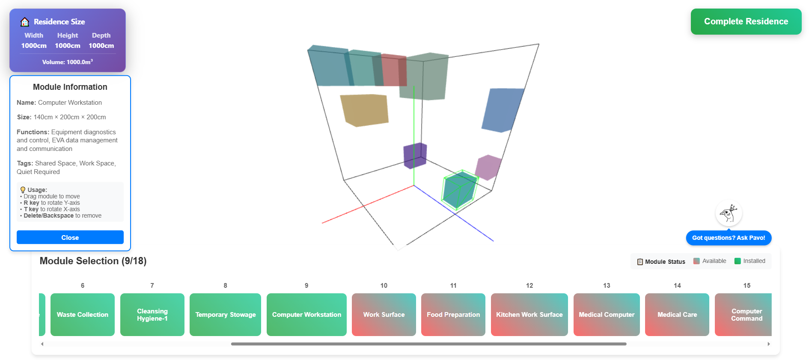
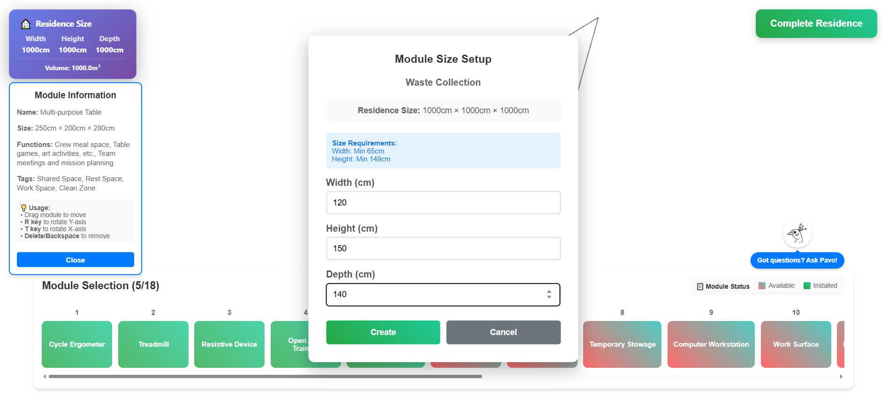
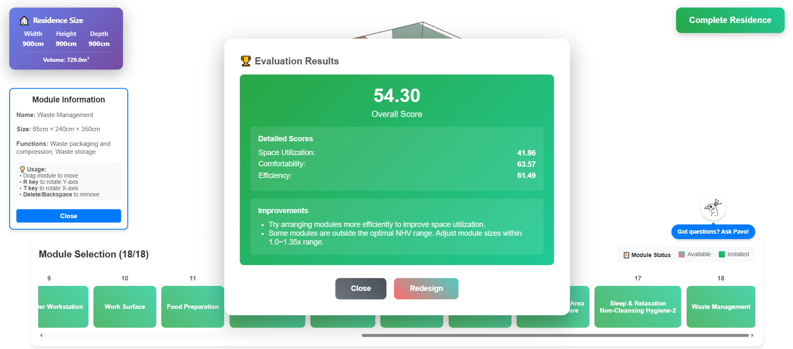
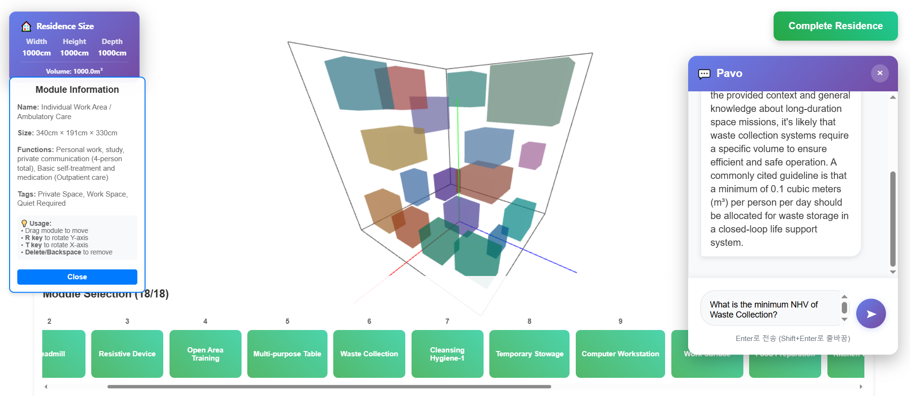

# H.E.R.A. (Habitat Efficiency Rating Algorithm)

## Introduction

This project is an interactive design simulator where users define the volume of a space habitat and arrange 18 essential functional modules in a 3D space to find the optimal layout. Going beyond simple arrangement, the simulator addresses design challenges by transforming the ambiguous concept of a 'good design' into a measurable score. It provides immediate data feedback, intuitively showing how a user's design is evaluated based on three core criteria: space efficiency, psychological stability, and meeting minimum Net Habitable Volume (NHV) requirements. Ultimately, this project presents a data-driven approach to simultaneously optimize efficiency, which is directly linked to cost, and crew quality of life, which is critical for the success of long-duration missions, making it an essential tool for creating safer and more livable space habitats for the future.

## Key Features in Action
### Design Process

| Feature | Screenshot | Description |
|---------|------------|-------------|
| **3D Design Environment** |  | Real-time 3D rendering with Three.js - drag, rotate, and arrange modules freely in the habitat space |
| **Module Configuration** |  | Set width/height/depth for each module based on minimum NHV requirements from NASA research |

### Evaluation & Feedback

| Feature | Screenshot | Description |
|---------|------------|-------------|
| **Evaluation Results** |  | Comprehensive scoring across Space Utilization, Comfortability, and Efficiency with detailed improvement suggestions |
| **AI-Powered Chatbot** |  | RAG-based Q&A system powered by NASA research papers - ask design questions and get instant, source-cited answers |

### Advanced Mode

| Feature | Screenshot | Description |
|---------|------------|-------------|
| **Mission Selection** |  | Choose between Default, Mars (long-duration focus), or Lunar (EVA-efficiency focus) mission profiles with customized evaluation weights |

## What it is

We have developed H.E.R.A., a data-driven 'Interactive Space Habitat Design and Evaluation Simulator.'

H.E.R.A. is a visual tool that allows users to define the overall volume of a space habitat and arrange 18 essential functional modules for long-duration space missions in a 3D virtual space to explore optimal layouts. Once a user completes their design, JSON data containing the position, size, and rotation of each module is sent to an evaluation server via an API. The server analyzes the submitted layout in real-time, converting the design's effectiveness into a quantitative score and providing immediate feedback to the user.

## Tech Stack

**Programming Languages:**
JavaScript (ES6+), HTML5, CSS3, Java

**Libraries & Frameworks:**
Three.js, OrbitControls, Spring Boot, Spring Data JPA

**Build Tools:**
Node.js, npm, Webpack, Gradle

**Graphics Technology:**
WebGL

**AI/ML & RAG System:**
Ollama, nomic-embed-text, Apache PDFBox

## How we used the data

All core data for this project was built upon two provided NASA-related research papers.

### 1. Module Definitions and Minimum Requirement Data

**Data Source:** "Defining the Required Net Habitable Volume for Long-Duration Exploration Missions" (Stromgren et al., 2020) [1]

- **Selection of 18 Essential Modules:** We adopted the 18 functions specified in Table 16 (Combined Functional Spaces) of the paper as the default modules for our simulation. This ensures that users consider all essential functions required for a real long-duration exploration mission.

- **Setting Minimum Volume per Module:** We extracted the minimum volume value for each module (e.g., 'Food Preparation' = 4.35 m³) directly from the paper to provide as baseline data for users when sizing modules.

- **Setting Minimum NHV Thresholds:** The fundamental Pass/Fail condition of our evaluation system is to check whether all 18 individual modules meet their respective minimum required volumes. The minimum NHV value for each functional space, as specified in the paper (e.g., 'Food Preparation' ≥ 4.35 m³), is set as an absolute standard. If even a single module fails to meet this criterion, the design is considered a failure. This is a stricter and more realistic validation method that ensures every essential function is guaranteed a minimum amount of space.

### 2. Theoretical Framework for the Evaluation System

**Data Source:** "A Tool for Automated Design and Evaluation of Habitat Interior Layouts" (Simon & Wilhite, 2014) [2]

- **Adoption of Evaluation Philosophy:** H.E.R.A.'s scoring system is a direct implementation of the 'multi-objective value function for quantifying layout effectiveness' concept proposed in this paper. The paper presents a philosophy that evaluation must comprehensively consider not just physical conditions but also various aspects like crew psychological well-being, work efficiency, and space utilization. We materialized this into three core evaluation categories: Space Utilization, Psychological Stability, and Efficiency.

- **Basis for 'Space Utilization' Score:** Based on the concept of minimizing "Unusable Volume" emphasized in the paper, we evaluate space utilization using the formula: Total NHV / Total Pressurized Volume. This serves as a key metric to measure how efficiently the limited space has been used. We set the optimal range at 70-77.5%; a lower value is considered wasteful, while a higher value indicates an overly dense design.

- **Basis for 'Psychological Stability' Score:** Inspired by the paper's key criteria of "Separation for Privacy" and "Separation for Noise," we developed our tag-based distance calculation method. This simplifies the paper's complex analysis of functional relationships into a tag system that is intuitive for users. For example, we calculate the distance between a 'Noise Generating' module (e.g., exercise equipment) and a 'Quiet Required' module (e.g., sleeping quarters) to assign a score. We applied a simplified version of the R·D (Range-Distance) analysis technique from the paper. We mathematically model the attenuation of noise based on distance from the source (attenuation function: `1/(1+0.3×distance)`) to quantify how much noise quiet spaces are exposed to. Additionally, for privacy, we evaluate the minimum distance between 'Private Spaces' and 'Common Spaces'. The separation between 'Clean Zones' and 'Contamination Zones' is assessed using the same principle.

### 3. Vectorization of Paper Data for the RAG System

**Data Sources:** [1], [2]

- **Building a PDF-based Vector Database:** We converted both full papers into a vector database to be understood and utilized by our AI. Text is extracted from the PDF files page by page and then split into chunks of up to 512 tokens. Paragraph and sentence boundaries are preserved, and a 50-token overlap between adjacent chunks is maintained to ensure contextual continuity. Each chunk is converted into a numerical vector (embedding) using the nomic-embed-text model. The hundreds of generated vectors are stored persistently in an H2 database and simultaneously loaded into a memory index for fast retrieval.

- **Vector Search-based Intelligent Evaluation and Chatbot:** When a user requests an evaluation in Advanced mode or asks a question to the chatbot, the system converts the query into a vector using the same embedding model. It then calculates cosine similarity to retrieve the most relevant paper chunks. In Advanced mode, an auto-generated query including the mission profile and habitat information is used to find supporting evidence from the papers, which is then reflected in score bonuses and feedback. In Chatbot mode, the retrieved content is passed to an LLM to generate well-sourced answers to the user's free-form questions. All responses include the filename and page number of the referenced paper, allowing users to verify the original source.

## How it works

### Basic Evaluation Mode for Beginners

**Design Submission:** The user specifies the habitat size and completes the arrangement of the 18 modules in the 3D space. Information on each module's position (x, y, z coordinates), size (width, height, depth), and rotation (x, y-axis angles) is sent to the evaluation server in JSON format via an API.

**Constraint Validation:**

A. Verify that all 18 modules have been used.

B. Check for overlaps by ensuring no module is located inside another.

C. Confirm that all modules are within the habitat boundaries.

D. Validate that all 18 modules meet their minimum required volume by comparing the user-set size against the minimum NHV values extracted from paper [1]'s Table 16.

**Score Calculation:**

**Space Utilization Score: (Overall Space Utilization Rate + NHV Appropriateness Score) × 0.4**

- The overall space utilization rate is calculated as the sum of the NHV of all 18 modules divided by the total habitat volume, with a perfect score awarded for rates between 70% and 77.5%.
- The NHV appropriateness score measures how many times larger each module is than its minimum requirement. A perfect score is given if it's within 1.0 to 1.35 times the minimum; points are deducted beyond that range.
- The two scores are averaged (50:50) and given a 40% weight in the final score.

**Psychological Stability Score: (Noise Separation + Privacy Protection + Clean Zone Separation) × 0.3**

- Noise separation calculates all distances between 'Noise Generating' and 'Quiet Required' modules and applies the attenuation function from paper [2] to determine the total noise exposure in quiet areas. Lower exposure results in a higher score.
- Privacy protection calculates the minimum distance between 'Private Spaces' and 'Common Spaces,' awarding a perfect score if the distance is at least one-third of the habitat's size.
- Clean zone separation evaluates the distance between 'Clean Zones' and 'Contamination Zones' using the same method.
- The three scores are averaged and given a 30% weight.

**Efficiency Score: Average Distance Between Work Spaces × 0.3**

- This calculates the average distance between all modules tagged as 'Work Space.' If workspaces are too close (<2m), it can cause interference; if they are too far (>70% of the habitat's diagonal), it wastes travel time.
- A high score is awarded for placement within the optimal range, with a 30% weight in the final score.

**Feedback Generation:** Feedback messages are automatically generated based on the score in each category. For example, a space utilization score above 85 yields positive feedback like "Excellent space utilization," while a comfort score below 60 provides suggestions for improvement like "Place noise-generating modules further apart." The final scores, validation results, and feedback are returned as a JSON object.

### Advanced Evaluation Mode for Experts

**Design Submission:** The process is similar to Basic mode, but Advanced mode introduces additional constraints for a Moon or Mars mission, encouraging more thoughtful design choices.

**Basic Constraint Validation:** The same checks as in Basic mode are performed.

**Mission-Specific Weight Readjustment:** For a Mars mission, which is long-duration, the weights are adjusted to emphasize Space Utilization (45%) and Comfort (35%) over Efficiency (20%). Conversely, a Moon mission, characterized by short-term stays and frequent EVA, prioritizes Efficiency (45%) over Space (30%) and Comfort (25%). The three pre-calculated scores are re-weighted to produce a mission-optimized final score.

**Research-Based Enhanced Feedback:** Feedback retrieved from the RAG system is added to the feedback section. This provides specific, evidence-based feedback like, "Research indicates: Excellent privacy configuration for long-duration Mars missions. Crew psychological well-being is well addressed." The referenced paper and page number are cited to ensure credibility.

### Paper-Based Q&A Chatbot

**Receiving User Queries:** Users can ask free-form questions through a separate chatbot interface, such as "What is the minimum NHV for sleep quarters?" or "How should noise-generating equipment be positioned?"

**Semantic Search:** The question text is converted into a vector, and its cosine similarity is calculated against the hundreds of stored paper chunk vectors. The top K (default 5) most similar chunks are selected. For a query like "sleep quarters NHV," chunks near Table 16 in paper [1] would be retrieved with high similarity.

**Context-Aware Answer Generation:** The text and source information of the retrieved chunks are passed to an LLM. The prompt includes a role definition ("You are a space habitat design expert"), the retrieved paper content, the user's question, and a constraint ("Answer concisely in 3-4 sentences"). The LLM generates an accurate answer based on the provided context.

**Returning Sourced Responses:** The final response includes the LLM-generated text, a list of referenced paper filenames and page numbers, and the full text and similarity score of each retrieved chunk. This allows users to verify the source of the answer and refer to the original paper if needed.

## References

[1] Stromgren, C., et al. (2020). "Defining the Required Net Habitable Volume for Long-Duration Exploration Missions". NASA Technical Reports.

[2] Simon, M., & Wilhite, A. (2014). "A Tool for Automated Design and Evaluation of Habitat Interior Layouts". AIAA SPACE 2014 Conference and Exposition.

## Team

Retro - 2025 NASA Space Apps Challenge Seoul